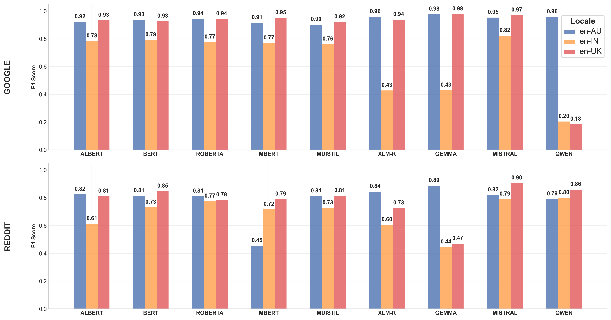
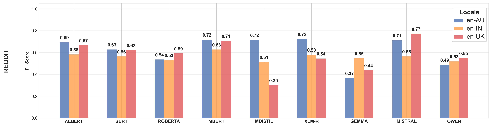

# BESSTIE: A Benchmark for Sentiment and Sarcasm Classification for Varieties of English

**Authors**
- [Dipankar Srirag](https://dipankarsrirag.github.io/)
- [Aditya Joshi](https://www.unsw.edu.au/staff/aditya-joshi)
- Jordan Painter
- [Diptesh Kanojia](http://dipteshkanojia.github.io)

**Accepted to Findings of ACL 2025**

## Abstract

Despite large language models (LLMs) being known to exhibit bias against non-mainstream varieties, there are no known labeled datasets for sentiment analysis across English varieties. To address this gap, we introduce `BESSTIE`, a benchmark for sentiment and sarcasm classification for three varieties of English: Australian (`en-AU`), Indian (`en-IN`), and British (`en-UK`). 

Using web-based content from two domains, namely, Google Place reviews and Reddit comments, we collect datasets for these language varieties using two methods: location-based and topic-based filtering. Native speakers of the language varieties manually annotate the datasets with sentiment and sarcasm labels. Subsequently, we fine-tune nine LLMs (representing a range of encoder/decoder and mono/multilingual models) on these datasets, and evaluate their performance on the two tasks.

Our results reveal that the models consistently perform better on inner-circle varieties (i.e., `en-AU` and `en-UK`), with significant performance drops for `en-IN`, particularly in sarcasm detection. We also report challenges in cross-variety generalisation, highlighting the need for language variety-specific datasets such as ours. `BESSTIE` promises to be a useful evaluative benchmark for future research in equitable LLMs, specifically in terms of language varieties.

The `BESSTIE` dataset is available on request [here](https://huggingface.co/datasets/unswnlporg/BESSTIE).

## Comparison with Existing Benchmarks

| Benchmark | Sent. | Sarc. | Eng. | Var. |
|:---------:|:---------:|:---------:|:---------:|:---------:|
|Cieliebak et al. (2017) | ✅ | ❌ | ❌ | ❌ |
|Wang et al. (2018) | ✅ | ❌ | ✅ | ❌ |
|Alharbi et al. (2020) | ✅ | ❌ | ❌ | ✅ |
|Abu Farha et al. (2021) | ✅ | ✅ | ❌ | ✅ |
|Elmandany et al. (2023) | ✅ | ✅ | ❌ | ✅ |
|Faisal et al. (2024) | ✅ | ❌ | ❌ | ✅ |
|`BESSTIE`| ✅ | ✅ | ✅ | ✅ |

*Comparison of `BESSTIE` with past benchmarks for sentiment or sarcasm classification. 'Sent.' indicates sentiment classification, 'Sarc.' denotes sarcasm classification, 'Eng.' denotes English, and 'Var.' denotes language varieties. A checkmark (✅) denotes the availability of a particular feature, while a cross (❌) indicates its absence*

## Methodology


*Methodology of `BESSTIE`. (a) Collection, (b) Annotation, and (c) Evaluation*

We collect textual posts from two domains: Google Places reviews and Reddit comments, using two filtering methods:

1. **Location-based filtering**: We select reviews posted for locations in the three countries. Specifically, we collect reviews posted in cities in AU, IN and UK, and their corresponding ratings (1 to 5 stars, where 5 is the highest) using the [Google Places API](https://developers.google.com/maps/documentation/places/web-service/overview).

2. **Topic-based filtering**: We choose up to four subreddits per language variety:
   - `en-AU`: [r/melbourne](https://www.reddit.com/r/melbourne/), [r/AustralianPolitics](https://www.reddit.com/r/AustralianPolitics/), [r/AskAnAustralian](https://www.reddit.com/r/AskAnAustralian/)
   - `en-IN`: [r/India](https://www.reddit.com/r/india/), [r/IndiaSpeaks](https://www.reddit.com/r/IndiaSpeaks/), [r/BollyBlindsNGossip](https://www.reddit.com/r/BollyBlindsNGossip/)
   - `en-UK`: [r/England](https://www.reddit.com/r/England/), [r/Britain](https://www.reddit.com/r/Britain/), [r/UnitedKingdom](https://www.reddit.com/r/UnitedKingdom/), [r/GreatBritishMemes](https://www.reddit.com/r/GreatBritishMemes/)

These subreddits were selected based on the understanding that they feature popular discussions specific to a variety, making it highly likely that contributors use the appropriate language variety.

### Annotation Process

We hired three annotators, each representing one of the three language varieties. The annotators assigned two labels to each review/post:

1. **Sentiment**: Negative (0), Positive (1), or Discard (2)
2. **Sarcasm**: Not Sarcastic (0), Sarcastic (1), or Discard (2)

Annotators were instructed to use the "Discard" label for uninformative examples with no apparent polarity and in some cases, for computer-generated messages.

### Example Annotations

| Variety | Comment | Sentiment | Sarcasm |
|:---------:|:---------:|:---------:|:---------:|
|`en-AU`| *Well set out, good stock and very friendly country staff* | 1 | 0|
| | *S\*\*t. Christ isn't back, is he?* | 0 | 1 |
| `en-IN` | *Good quality foods are supplied here* | 1 | 0 |
| | *Coz we all have free internet.* | 0 | 1 |
| `en-UK` | *Traditional friendly pub. Excellent beer* | 1 | 0 |
| | *What a brave potatriot* | 0 | 1 |

## Models Evaluated

We evaluated a total of nine LLMs representing a range of architectures and sizes:

- [BERT-Large](https://huggingface.co/google-bert/bert-large-cased) (`BERT`)
- [RoBERTa-Large](https://huggingface.co/FacebookAI/roberta-large) (`ROBERTA`)
- [ALBERT-XXL-v2](https://huggingface.co/albert/albert-xxlarge-v2) (`ALBERT`)
- [Multilingual-BERT-Base](https://huggingface.co/google-bert/bert-base-multilingual-cased) (`MBERT`)
- [Multilingual-DistilBERT-Base](https://huggingface.co/distilbert/distilbert-base-multilingual-cased) (`MDISTIL`)
- [XLM-RoBERTa-Large](https://huggingface.co/FacebookAI/xlm-roberta-large) (`XLM-R`)
- [Gemma2-27B-Instruct](https://huggingface.co/google/gemma-2-27b-it) (`GEMMA`)
- [Mistral-Small-Instruct-2409](https://huggingface.co/mistralai/Mistral-Small-Instruct-2409) (`MISTRAL`)
- [Qwen2.5-72B-Instruct](https://huggingface.co/Qwen/Qwen2.5-72B-Instruct) (`QWEN`)

## Key Results

### Sentiment Classification


*Performance comparison of various models on the sentiment classification task across different English varieties (`en-AU`, `en-IN`, and `en-UK`).*

For sentiment classification, `MISTRAL` achieves the highest average performance across all varieties, with an `F-SCORE` of `0.91` on the GOOGLE subset and `0.84` on the REDDIT subset. In contrast, `QWEN` reports the lowest average performance across all varieties on the GOOGLE subset, with an average `F-SCORE` of `0.45`, while `GEMMA` exhibits the lowest average performance across all varieties on the REDDIT subset, with an `F-SCORE` of `0.60`.

### Sarcasm Classification


*Performance comparison of various models on the sarcasm classification task across different English varieties (`en-AU`, `en-IN`, and `en-UK`)*

For sarcasm classification, both `MISTRAL` and `MBERT` achieve the highest average performance across all varieties, with an `F-SCORE` of `0.68`. In contrast, `GEMMA` again reports the lowest average performance across all varieties, with an average `F-SCORE` of `0.45`. The lower performance on sarcasm classification as compared to sentiment classification is expected because sarcasm often relies on not just subtle linguistic cues but also localised contemporary contextual information.

For more detailed results and discussion, please refer to the paper.

## Usage Guide

### 1. Setting Up the Environment

Before running any experiments, you need to set up your environment:

```bash
# Clone the repository
git clone https://github.com/unswnlp/BESSTIE.git
cd BESSTIE

# Create a virtual environment
python3 -m venv .venv

# Activate the virtual environment
source ./.venv/bin/activate  # On Linux/Mac
# or
.\.venv\Scripts\activate  # On Windows

# Install requirements
pip3 install -r requirements.txt
```

### 2. API Credentials Setup

Create a `.env` file in the root directory with the following credentials:

```
# Google Places API credentials
GOOGLE_PLACES_KEY=your_google_places_api_key

# Reddit API credentials
REDDIT_CLIENT=your_reddit_client_id
REDDIT_SECRET=your_reddit_client_secret
REDDIT_USER=your_reddit_username
REDDIT_PASS=your_reddit_password
```

You'll need to:
- Obtain a Google Places API key from the [Google Cloud Console](https://console.cloud.google.com/)
- Create a Reddit application in your [Reddit account preferences](https://www.reddit.com/prefs/apps) to get the client ID and secret

### 3. Dataset Collection

To collect the datasets used in the benchmark:

```bash
# Collect Google Places reviews
python3 Code/api/google_places.py

# Collect Reddit comments
python3 Code/api/reddit_threads.py
```

The collected data will be stored in the `Dataset/Raw Data/` directory.

### 4. Data Preprocessing and Validation

We provide several notebooks to help you understand and validate the collected data:

- **Language Validation**: `Notebooks/Language Probability.ipynb` - Uses fastText vectors to verify language.
- **Manual Variety Validation**: `Notebooks/Variety Identification - Manual.ipynb` - Contains details from manual validation.
- **Automatic Variety Validation**: `Notebooks/Variety Identification - Automatic.ipynb` - Uses an automatic variety predictor.

### 5. Data Annotation

If you wish to annotate your own data, please refer to the annotation guidelines provided in `Annotation Guidelines.docx`. Our annotation process involved:

1. Reading each review/comment carefully
2. Assigning sentiment labels (Negative/Positive/Discard)
3. Assigning sarcasm labels (Not Sarcastic/Sarcastic/Discard)

The annotation tool we used is a simple Excel spreadsheet with columns for text, sentiment, and sarcasm.

### 6. Preparing Data Splits

The collected and annotated data needs to be processed into the format required for training and evaluation:

```bash
# Process and split the data
python3 Code/data_processing.py
```

This script:
1. Reads the annotated Excel files
2. Applies preprocessing to the text
3. Filters out examples marked as "Discard"
4. Creates train/validation/test splits for each task, location, and domain
5. Saves the splits to CSV files in the appropriate directory structure

### 7. Running Experiments

We provide a benchmarking script and example configurations for all experiments described in the paper:

```bash
# Example: Run sentiment classification with BERT on Australian Google reviews
python3 Code/benchmark.py Example\ Configs/en-AU-Google-Sentiment-Classification.json
```

All experiment configurations are available in the `Example Configs/` directory. Here's a sample configuration:

```json
{
    "train_file":"Dataset/Splits/Sentiment/en-AU/Google/train.csv",
    "valid_file":"Dataset/Splits/Sentiment/en-AU/Google/valid.csv",
    "test_file":"Dataset/Splits/Sentiment/en-AU/Google/test.csv",
    "task":"sentiment",
    "model_name_or_path":"google-bert/bert-base-uncased",
    "type":"SEQ_CLS",
    "trust_remote_code":true,
    "torch_dtype":"auto",
    "attn_implementation":"eager",
    "low_cpu_mem_usage":false,
    "lora":false,
    "quant":false,
    "seed":50,
    "num_labels":2,
    "load_best_model_at_end":true,
    "per_device_train_batch_size":8,
    "per_device_eval_batch_size":8,
    "warmup_steps":500,
    "weight_decay":0.01,
    "learning_rate":2e-5,
    "num_train_epochs":30,
    "eval_strategy":"steps",
    "save_steps":400,
    "logging_steps":400,
    "result_dir":"Results/",
    "logging_dir":".logs/",
    "output_dir":".output/",
    "cache_dir":".cache/",
    "token":"[YOUR TOKEN]"
}
```

Make sure to replace `[YOUR TOKEN]` with your HuggingFace token if you're using models that require authentication.

### 8. Parameter-Efficient Fine-Tuning Options

Our benchmark script supports several advanced fine-tuning techniques:

- **LoRA** (Low-Rank Adaptation): Set `"lora": true` in the configuration
- **Quantization**: Set `"quant": true` to enable 4-bit quantization for large models

These options are useful when working with the larger models like GEMMA, MISTRAL, and QWEN.

### 9. Analyzing Results

After running the experiments, the results will be saved to the `Results/` directory:

```
Results/
├── BERT/
│   ├── Sentiment/
│   │   ├──Google/
│   │   │   ├──metrics.csv
│   │   │   └──predictions.csv
│   │   └──Reddit/
│   │       ├──metrics.csv
│   │       └──predictions.csv
│   └── Sarcasm/
│       ├──Google/
│       │   ├──metrics.csv
│       │   └──predictions.csv
│       └──Reddit/
│           ├──metrics.csv
│           └──predictions.csv
└── ...
```

We provide a notebook to help you analyze the results:

```bash
# Open the results analysis notebook
jupyter notebook Notebooks/Results.ipynb
```

This notebook will help you:
- Load and aggregate the results
- Generate plots like those in the paper

We also provide a notebook to perform cross-variety analysis:
```bash
# Open the mistral cross-variety notebook
jupyter notebook Notebooks/Mistral\ Example/cross-variety.ipynb
```

## Citation

If you use the BESSTIE benchmark in your research, please cite our paper:

```bibtex
@misc{srirag2024besstiebenchmarksentimentsarcasm,
      title={BESSTIE: A Benchmark for Sentiment and Sarcasm Classification for Varieties of English}, 
      author={Dipankar Srirag and Aditya Joshi and Jordan Painter and Diptesh Kanojia},
      year={2024},
      eprint={2412.04726},
      archivePrefix={arXiv},
      primaryClass={cs.CL},
      url={https://arxiv.org/abs/2412.04726}, 
}
```

## License

[License information will be available upon publication]
